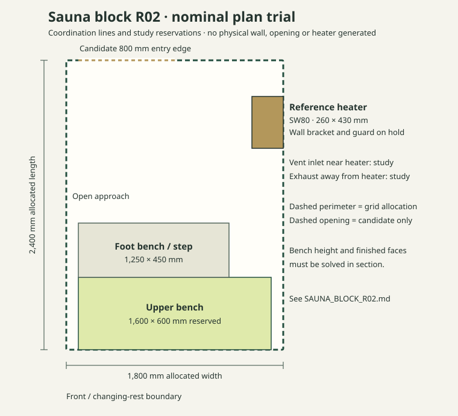

# Sauna block R02 · manual equipment and bench fit

Status: **candidate fit in the R01 plan, not an installed heater, released doorway, engineered bench or approved wet/thermal assembly**. R01 remains the whole-plan reference. This pass solves one program block manually before changing the shared Cassette 01 generator or propagating a sizing rule to other block combinations.

## Reference equipment and source

For a private, non-residential auxiliary sauna study, use **Harvia The Wall SW80 HSW800400M, 8 kW electric** as the reference, not an automatic purchase specification. The [manufacturer's current product data](https://www.harvia.com/en/products/HSW800400M/the-wall-sw80-80-kw-blacksteel) gives a recommended room volume of **7–12 m³**, heater **430 × 260 × 700 mm**, **70 mm side clearance**, **80 mm minimum floor clearance**, **1,200 mm ceiling clearance**, and **2,000 mm minimum sauna height**. The manufacturer tells users to check the installation manual for updated requirements. Its published front clearance entries differ by material, so this study does **not** use a front minimum as a general walking or guard clearance. A final choice depends on finished volume, supply, installation manual, and intended operating intensity; the product is listed for household users.

[Harvia's bench guidance](https://www.harvia.com/en-US/ideas-and-trends/products/choosing-sauna-benches/) recommends 1,100–1,200 mm between the upper bench and ceiling, at least 500 mm upper bench depth, about 600 mm per seated person, and roughly 350 mm step height. This layout uses one rear bench rather than opposing benches; the same guidance says opposing benches generally need at least 2,200 mm room width, more than the 1,800 mm nominal Sauna allocation.

## Nominal plan trial, in millimetres

Local origin is at the **front west corner** of the 1,800 × 2,400 mm *allocated* Sauna rectangle. X increases east toward the outer wall; Y increases rearward. All equipment and bench rectangles are **study reservations**, measured from the nominal coordination lines rather than a finished face. Bench framing and fire protection are not designed.

| Reservation | X extent | Y extent | Purpose / check |
|---|---:|---:|---|
| Candidate entry edge | 100–900 | 0 | 800 mm nominal on the changing/rest boundary; outward swing toward changing/rest to investigate; no cut generated |
| Upper bench | 100–1,700 | 1,800–2,400 | 1,600 × 600 mm reservation across rear; two 600 mm seats are possible on paper, pending finished face/bench support |
| Foot bench/step | 100–1,350 | 1,350–1,800 | 1,250 × 450 mm reservation; final stair/foot positions and guard remain open |
| Reference heater body | 1,540–1,800 | 300–730 | 260 mm depth against east wall × 430 mm length along that wall; bracket location/penetration unapproved |
| Clear plan strip before steps | 100–1,540 | 730–1,350 | At least 1,440 mm nominal here; this is not a certified accessible route |

At y = 300–730 mm the heater projects into the room; its west face is x = 1,540 mm. The candidate entry ends at x = 900 mm on the front edge and is not aligned with the heater body. Its rear edge is 620 mm in front of the foot-bench start; the upper bench is farther away. The chosen rectangles do not overlap. Mounting the heater at its specified 80 mm floor clearance would put its 700 mm high body top near 780 mm above the unfinished floor. The *nominal* 2,100 mm room height would leave 1,320 mm above it, or 120 mm more than the listed 1,200 mm minimum. **That margin is not available for arbitrary ceiling or floor build-up**: the actual finished ceiling and installation datum have not been determined.

For an upper-bench target of 900–1,000 mm above a *finished* floor, a finished 2,100 mm ceiling would leave 1,200–1,100 mm overhead. This is a relationship to resolve with bench steps and finished levels, not an approved bench elevation. Exact seat capacity, stable bench anchorage, guard/handhold and safe door approach need drawing and physical review.

## Volume and finish sensitivity

The nominal allocated room volume is `1.8 × 2.4 × 2.1 = 9.072 m³`, inside the SW80's 7–12 m³ published recommendation. This is **not** the actual heater-sizing volume. For a *symmetric hypothetical* loss `t` millimetres at both X walls, both Y walls and ceiling, with no floor loss or glass correction, the illustrative volume is `(1800−2t) × (2400−2t) × (2100−t) / 10⁹` m³:

| Hypothetical `t` | Illustrative volume | SW80's published 7–12 m³ window |
|---:|---:|---|
| 0 mm | 9.072 m³ | Within |
| 40 mm | 8.220 m³ | Within |
| 80 mm | 7.421 m³ | Within, close to lower bound |
| 100 mm | 7.040 m³ | Borderline; rounding and floor/ceiling construction matter |

`t` is a sensitivity variable, **not** a selected wall assembly. At `t = 80 mm`, the illustrative finished plan is 1,640 × 2,240 mm. The trial's 1,600 mm bench, heater position and door reservation were drawn on *nominal* lines and must be redrawn inside that smaller finished rectangle. At `t = 100 mm` plus any finished floor loss, the heater may fall below its published minimum room volume. Glazing and uninsulated surfaces can also change the manufacturer-equivalent volume; confirm using the selected manual/calculator after finishes and glazing are defined.

The Studio control now shows an **informational nominal-volume screen** for the SW80 whenever Sauna width or length changes. It calculates `allocated width × allocated length × generated clear Z / 10⁹` in m³. A range match means only that the raw, unlined planning volume sits between 7 and 12 m³; it never sets `plan.technicalValid` true. At the R01 default (3 × 4 grid cells) it is **9.072 m³**, while 2 × 4 is **6.048 m³** (below range) and 4 × 4 is **12.096 m³** (above range). Other heater selections or a different whole-plan arrangement may be appropriate for those options. The cassette geometry's regulatory gate is independent of this product screen.

## Ventilation and whole-plan interfaces

Harvia's [electric-sauna ventilation guidance](https://support.harvia.com/hc/en-gb/articles/21953036825628-Ventilation-in-the-sauna) calls for six air changes per hour and distinguishes mechanical from gravity inlet positions. It requires low exhaust away from the heater for those arrangements, with sensor placement checked against supply air. At the nominal 9.072 m³, six changes would imply 54.432 m³/h *of room air* as a simple screening multiplication; actual fan/duct sizing, pressure and control require a ventilation design. Reserve an inlet near the heater for a gravity study and an exhaust near the bench side, then recheck against a selected ventilation method. No wall or roof penetration is generated. If exhaust goes into the adjacent washing room, Harvia states an under-door opening of at least 100 mm and mechanical exhaust are needed; R01 currently gives Sauna direct access from changing/rest, so that different route would change the plan.

## Result and next manual gate

**The nominal rectangles fit and the reference heater's published volume range contains the nominal volume.** This is enough to retain R01's Sauna allocation for a detailed section and finished-surface study. It is **not enough to mark the Sauna block technically valid**. Obtain current installation instructions, fix the actual heated/finished volume and ceiling datum, draw the partition and lining thicknesses, prove the heater/bracket can be mounted to engineered structure, and lay out the door, guard, steps and ventilation without conflict. Then recheck the washing block and changing/rest access against the whole plan. Do not turn these trial coordinates into arbitrary parametric heater placements.
