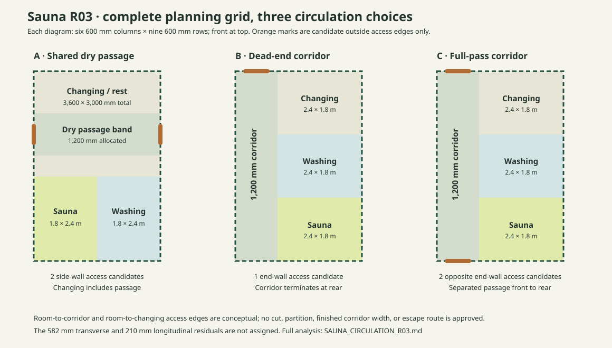

# Sauna R03 · whole-plan circulation comparison

Status: **manual spatial research**. All three studies keep the same Cassette 01 exterior, 10 module count, 600 mm coordination grid, roof bearing and regulatory dimensional screen. Colored blocks and door marks are reservations only. **No corridor partition or exterior/interior opening is generated.** Neither a second outside door nor a drawn corridor establishes a compliant escape route.

Follow-up: [R04 nominal whole-plan route study](SAUNA_ROUTE_R04.md) locates candidate side doors, a crossing band, changing seat, wet-room doors and a shower in study A. It also records the wet/dry traffic conflict that the block diagram alone cannot resolve.

Further comparison: [R05 wet-lobby plan](SAUNA_WET_LOBBY_R05.md) adds two cassette rows (12 modules total) to retain the R01 wet-room shapes and dry changing allocation while reserving a distinct 1,200 mm deep wet landing. R05 is a separate circulation study within Sauna, not a new structural preset or a solved wet assembly.

## Fixed geometry for this comparison

- System setting-out: 4,572 × 6,000 mm; outside-wall proxy: 4,596 × 6,024 mm = **27.686304 m²**.
- Unpartitioned interior estimate: 4,182 × 5,610 mm = **23.461020 m²**.
- Planning grid: six columns × nine rows at 600 mm = 3,600 × 5,400 mm = **19.44 m²**. The 582 mm width and 210 mm length residuals have no assigned finished position. Room and corridor areas below are grid allocations, not usable finished areas.
- Coordinates are `(x columns, y rows)` from the front left. The two corridor alternatives partition along x = 2; the side-access alternative keeps the R01 block rectangles.

| Study | Circulation and outside access | Changing/rest | Washing | Sauna | Candidate exterior openings |
|---|---|---:|---:|---:|---:|
| **A · Shared dry passage** | A 1,200 mm nominal clear-route band *inside* changing/rest crosses the building; proposed entrances on opposing long facades | 6 × 5 = 10.80 m², including a 4.32 m² passage band | 3 × 4 = 4.32 m² | 3 × 4 = 4.32 m² | **2**, both on long exterior walls |
| **B · Dead-end corridor** | 2-column × 9-row side corridor = **6.48 m²**; one entrance at the front short end; rear corridor terminates internally | 4 × 3 = 4.32 m² | 4 × 3 = 4.32 m² | 4 × 3 = 4.32 m² | **1**, front end wall |
| **C · Full-pass corridor** | Same **6.48 m²** corridor; exterior access at front and rear short ends | 4 × 3 = 4.32 m² | 4 × 3 = 4.32 m² | 4 × 3 = 4.32 m² | **2**, opposite end walls |

For A, changing/rest remains `(x 0–6, y 0–5)`, Sauna `(0–3, 5–9)` and Washing `(3–6, 5–9)`. The two side doors replace the earlier R01 front entry *candidate* in this study; retaining that front door would create a third opening and is not assumed. Both wet rooms still meet changing/rest. The passage band is a circulation reservation without separating walls. The non-passage remainder of changing/rest is 10.80 − 4.32 = **6.48 m² nominal**; its seating, storage and privacy must be checked against people traversing it.

For B and C, the corridor is `(x 0–2, y 0–9)` and all rooms occupy `(x 2–6)`: changing `(y 0–3)`, washing `(y 3–6)`, Sauna `(y 6–9)`. Each room needs a candidate door in the continuous corridor partition at x = 2. A room-to-room wet door is not assumed. The nominal corridor is **1,200 mm wide**, and the effective passage will be narrower after construction. No accessibility or escape-width compliance is inferred. The Sauna is **2,400 × 1,800 mm** rather than R01's 1,800 × 2,400 mm; its 9.072 m³ nominal volume is unchanged, but the R02 heater, bench and door placements **cannot be copied by rotation without a new manual fit and ventilation check**.

## Comparison and direction

**A is the most area-efficient candidate if the goal is two outside accesses without a private hallway.** It retains the R01 wet-block geometry and the most changing/rest allowance, but through movement across a changing room can conflict with privacy, seating and wet/dry separation. Side-wall exterior openings and their effects on cassette structure and weather detailing are unsolved. The 1,200 mm band is an allocation, not a demonstrated unobstructed finished passage.

**C is the clearer choice if two distinct outside doors must connect by a dedicated, separated passage.** It costs 6.48 m² of the 19.44 m² grid and leaves only 4.32 m² each for changing, washing and Sauna. It adds two end-wall openings, a long partition with three doors, more conditioned envelope traffic and a different Sauna shape. It requires full heater and bench redesign, plus an actual structural/opening solution before the two entries are real.

**B has the same corridor area cost as C but only one outside access.** It is worth retaining if circulation must be separated from changing/rest and the site permits only a front approach. It should not be selected as a supposed escape improvement merely because its corridor is drawn; fire/occupant-use review of the dead end and route is separate.

The present R01/R02 remains a *one-entrance shared-space reference* until a circulation route is selected. A provides a less costly **two-access alternative**, C the **full longitudinal pass** the owner proposed, and B the **dead-end comparator**. Do not silently treat A's two side doors as C's front-to-rear passage; these are different site connections.

## Manual checks before making a circulation parameter

1. Choose where people actually arrive and leave the site. Two exterior doors should serve a deliberate route, not appear because a diagram can accommodate them. Fix whether users may pass through changing/rest or require a private corridor.
2. Draw door widths, swings, weather/air boundaries and a walking route in *finished* dimensions. Check changing furniture and wet-room entry manoeuvres, including route width after partition/lining build-ups.
3. Develop cassette-compatible openings at the relevant side or end walls and the long interior corridor partition. None is in the System generator; roof/floor supports, corner restraints and load paths must be checked.
4. In B/C, redraw the Sauna heater, benches, ventilation and guard in the rotated 2,400 × 1,800 mm room; in A, redo R02 after assigning residual space and real linings. Redesign washing and changing in each whole-plan option.
5. Verify actual use, occupancy, fire/egress and accessibility requirements with the Lithuanian authority/design team. This study makes **no claim** that one or two doors is required or sufficient.
