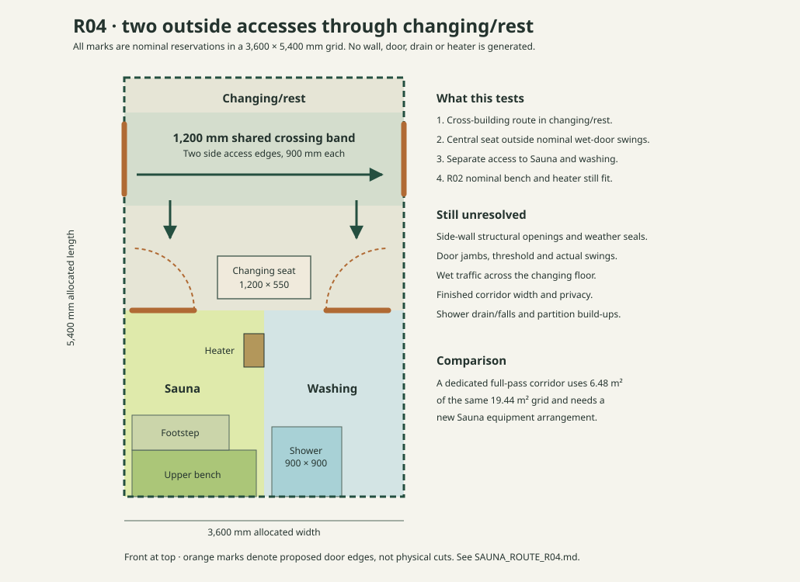

# Sauna R04 · two side accesses through changing/rest

Status: **manual whole-plan fit study**, following [R01](SAUNA_MANUAL_PLAN_R01.md), the [R02 Sauna bench/heater reservation](SAUNA_BLOCK_R02.md) and [R03 circulation comparison](SAUNA_CIRCULATION_R03.md). R04 tests the area-efficient two-access study A. It does not generate walls, doors, service penetrations or a verified escape route. All coordinates are millimetres on the **3,600 × 5,400 mm nominal grid**, with `(0,0)` at the front west corner; the 582 mm width and 210 mm length residuals still have no finished allocation.

## Block and route reservations

| Element | Nominal X extent | Nominal Y extent | Purpose |
|---|---:|---:|---|
| Changing/rest | 0–3,600 | 0–3,000 | Dry room and shared access to Sauna and washing |
| Shared crossing band | 0–3,600 | 450–1,650 | 1,200 mm planning depth between two opposing side entry candidates |
| West side entry | boundary x = 0 | 600–1,500 | 900 mm nominal exterior door reservation |
| East side entry | boundary x = 3,600 | 600–1,500 | Second 900 mm nominal exterior door reservation |
| Changing seat/storage reservation | 1,200–2,400 | 2,300–2,850 | 1,200 × 550 mm; leaves side approaches to wet doors |
| Sauna block | 0–1,800 | 3,000–5,400 | Same 1,800 × 2,400 mm R01/R02 allocated shape |
| Washing block | 1,800–3,600 | 3,000–5,400 | Same 1,800 × 2,400 mm allocated shape |
| Sauna door candidate | x = 100–900 | boundary y = 3,000 | 800 mm nominal; proposed swing **out** into changing/rest |
| Washing door candidate | x = 2,600–3,400 | boundary y = 3,000 | 800 mm nominal; proposed swing into changing/rest for clash study only |
| Shower reservation | 1,900–2,800 | 4,500–5,400 | 900 × 900 mm equipment envelope, without drain, fall or waterproofing specification |

The Sauna bench/footstep and heater rectangles from R02 fit *nominally* inside the Sauna block. Their local coordinates translate by +3,000 mm in Y. A candidate Sauna door opening outward is consistent with [Finlandia Sauna's door guidance](https://finlandiasauna.com/specifications/sauna-door/), but 800 mm width and hinge location here are **study choices**, not the manufacturer's supplied door, a Lithuanian legal requirement, or a finished hardware schedule. The manufacturer also recommends no locking mechanism; final door details require review.

The two side entrances sit wholly within the 1,200 mm crossing band, leaving 150 mm of the nominal band on either side of their 900 mm openings. West-to-east crossing is 3,600 mm across changing/rest. From that band, the west or east side strip continues to its corresponding wet-room door. Both wet-room swings are reserved within the side zones, outside the central seat's X extent; neither overlaps that **nominal** furniture rectangle. A wet-room door leaf may still reduce usable approach width while moving, and the actual finish/partition dimensions and hinge clearances have not been drawn.

**The wet/dry interface is the main conflict to solve next.** Sauna and washing users both return into changing/rest; shower traffic can carry water across the same room that holds seating and the shared side-to-side passage. R04 has no direct Sauna–washing door. Adding one would change the R02 heater/bench arrangement on their shared partition and requires a new thermal/moisture and opening design. A dry crossing is therefore an *operational intent*, not a verified dry floor. Check drainage, thresholds, splash containment and how occupants use the routes before designating the passage dry.

## Finish sensitivity and corridor comparator

The full building's current clear-width estimate is **4,182 mm**. The 3,600 mm program rectangle deliberately leaves **582 mm** transverse residual unassigned. R04 cannot claim a finished 1,200 mm passage from this grid alone; side-door jambs, internal floor build-ups, furniture and any enclosure detail must be placed and measured. The shared crossing has **no corridor partition**. Its 1,200 mm Y-band may remain available if the changing furniture and door swings stay out of it, but that condition is not yet an engineered plan.

For the dedicated R03 B/C side corridor, the same **1,200 mm is its entire allocated X width**. A hypothetical 80 mm external-wall lining and an *unselected* 100 mm corridor partition would reduce its possible clear width to `1,200 − 80 − 100 = 1,020 mm` before any further projections. This is only a sensitivity example. No claim of accessibility, egress compliance or adequate operational width follows from 1,020 mm. At ten modules the separate corridor also occupies **6.48 m²** of the 19.44 m² program grid and rotates the Sauna block, requiring a new equipment plan.

## Current conclusion and next gate

The R04 reservations demonstrate **nominal, non-overlapping positions** for two side accesses, changing seating, separate wet-room doors, shower equipment and the R02 Sauna study inside one 10-module shell. R04 remains preferable *for spatial efficiency* if through movement across changing/rest is acceptable. It loses that advantage if privacy, splash management or real door sweeps force a separated corridor or a larger wet lobby. The full-pass R03 study remains the comparator when dedicated circulation and opposite **end-wall** entries are required.

Next, choose a real partition/lining and entry-door build-up, measure the finished route and wet-door approaches, and design a wet/dry transition. The two side-wall openings are especially consequential for the cassette load path and weather envelope; no structural cuts have been approved. Actual occupancy, fire escape, accessibility, drainage and site/land conditions require use-specific review. Dimensional envelope screening alone does not establish permit exemption or approved egress.
