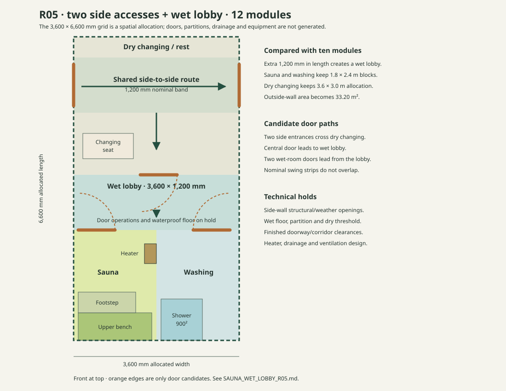

# Sauna R05 · two side accesses and a wet lobby

Status: **preferred whole-plan research candidate for a private, non-residential Sauna when two side accesses are useful and changing/rest should remain dry**. This is a manual allocation and door-swing reservation, not a released room assembly, egress plan, door schedule or physical cassette opening. It develops the wet/dry conflict recorded in [R04](SAUNA_ROUTE_R04.md). The dedicated corridor alternatives remain available in [R03](SAUNA_CIRCULATION_R03.md).

## Building and allocation

Use **12 of the existing 600 mm Cassette 01 modules**, retaining the same 4,572 mm setting-out width, roof bearing, structural geometry and fixed 2,100 mm nominal wall height. The current System/Studio model reports **4,596 × 7,224 mm outside-wall plan = 33.201504 m²**, **4,182 × 6,810 mm unpartitioned interior = 28.479420 m²**, modelled height **2,576 mm**, and roof support-span screen **4,572 mm**. These are the existing geometric checks; they do not establish legal area, foundation adequacy, an actual finished ceiling or permit exemption. Relative to the R04 ten-module study, the outside-wall area rises by **5.515200 m²**, remaining well below the 50.00 m² outside-wall cap.

The six-column × eleven-row coordination rectangle is **3,600 × 6,600 mm = 23.76 m²**. Coordinates use millimetres from the front west corner. The 582 mm transverse and 210 mm longitudinal residuals are still unassigned. Block rectangles are set-out allowances; internal partition and lining thicknesses must be deducted from finished room sizes.

| Block or route | X extent | Y extent | Nominal allocation |
|---|---:|---:|---:|
| Changing/rest and side-to-side route | 0–3,600 | 0–3,000 | 10.80 m², including a 1,200 mm route band at y = 450–1,650 |
| Wet lobby | 0–3,600 | 3,000–4,200 | 4.32 m²; separates the dry changing floor from wet-room door approaches |
| Sauna | 0–1,800 | 4,200–6,600 | 4.32 m²; same 1,800 × 2,400 mm allocation studied in R02 |
| Washing/bathing | 1,800–3,600 | 4,200–6,600 | 4.32 m²; reserve shower and drain for further work |

The two **outside side-door candidates** remain at x = 0 and x = 3,600, each at y = 600–1,500. A **dry-to-wet door candidate** is centered at y = 3,000, x = 1,450–2,250. It is followed by two **wet-room door candidates** at y = 4,200: Sauna x = 100–900, washing x = 2,600–3,400. Each 800 mm candidate and its swing arc is only a planning reservation. The Sauna candidate opens outward into the wet lobby in accordance with the sauna-door mechanism investigated in R04; the other swings and hardware remain under review. The three nominal wet-lobby door-swing envelopes occupy distinct X strips (100–900, 1,450–2,250, and 2,600–3,400) so they do not overlap each other in plan. **This does not prove safe simultaneous operation or usable finished circulation**; people need manoeuvring space, and walls and doors have thickness.

Keep changing seating at x = 200–1,300, y = 2,100–2,650 so it misses the central dry-to-wet door candidate. The shared outside crossing remains near the front. Wet traffic returns to the wet lobby first, crossing the separating door before reaching the changing floor. This is a more credible *spatial* wet/dry separation than R04, provided the wet lobby actually receives an appropriate waterproof floor, falls/drainage as designed, ventilation and a moisture-resistant door/partition transition. No such physical assembly is currently generated. The [Finnish Sauna Society's wet-room discussion](https://sauna.fi/saunatietoa/saunan-rakentaminen-ja-kaytto/saunan-rakennevaatimukset/) highlights how critical continuity and drying are at wet-room interfaces.

## Why 12 modules here

The added two 600 mm rows form a **1,200 mm nominal wet lobby** while preserving both R01/R02 wet-room dimensions *and* a 3,000 mm long changing/rest allocation. Trying to insert a 1,200 mm lobby into the R04 **ten-module** grid without extending the building leaves only 1,800 mm of changing/rest depth if the wet rooms remain 2,400 mm long. That smaller changing area no longer matches the tested side-to-side crossing plus seat and dry-to-wet door arrangement. The 12-module option is a purposeful smaller-than-50 m² plan, not an attempt to fill the regulatory cap.

The R02 heater's **9.072 m³ nominal Sauna allocation** remains the same because Sauna width, length and nominal height are unchanged. The heater mounting, bench support, ventilation, finished volume, safety clearances and manufacturer's current installation instructions still require verification. The R03 full-pass corridor is the stronger fallback if independent front-to-rear passage, separation from changing users, or site-specific circulation is essential; its room shapes require a new sauna fit study.

## Gate before treating R05 as solved

1. Detail and dimension the *finished* wet-lobby partition/door, corridor band, side doors and wet-room door operations. Check people passing and opening doors simultaneously, including privacy at both exterior entrances.
2. Design waterproofing, floor falls and drain strategy for washing and wet lobby, plus the transition to dry changing; verify the structural cassette floor and wall interfaces can carry it.
3. Resolve both exterior side-wall cassette openings, internal partitions, heater attachment and ventilation penetrations with engineered structural/weather/thermal details. No existing cassette output contains them.
4. Check occupancy and use-specific Lithuanian fire, accessibility, utilities, wastewater, site/land and SLD requirements separately. Two doors and dimensional compliance alone do not prove any regulatory status.

R05 is a **planning candidate**, not an automatic default for every Sauna size. The existing ten-module studies remain valid research alternatives. Parameterize this additional layout only with a hard minimum of **12 modules** and at least five 600 mm rows for changing/rest, two for the wet lobby, and two for each wet room; smaller or rearranged combinations need their own whole-plan review.
